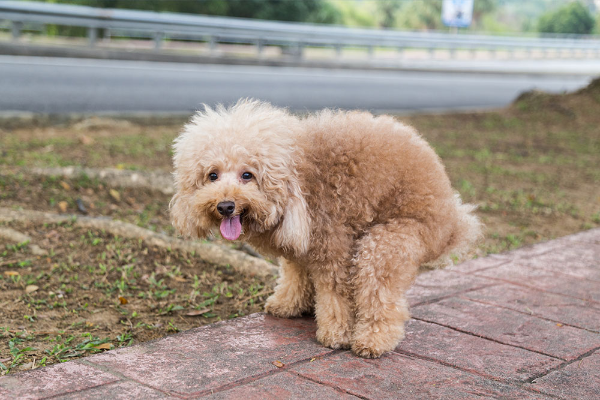

## Puppy Poop Preventer

Have you ever had a puppy poop inside your house? Did you ever wish you could quickly detect when it was about to do its dirty deed, so that you could rush it outside just in time? Well, fear no more; we're proud to present a puppy poop preventor (PPP for short)! 

Okay, fine, it's still in progress. Basically, the plan is to take a real-time dog detector and hook it up to an image classifier that will tell whether the detected dogs are pooping or not. If we do detect a pooping pupper, then we can sound an alarm system, so that the owner can come to the rescue. If we pair this fancy ML model with a surveillance camera of some sort, then we'll never have to worry about cleaning the carpet again. (This would certainly improve my peace of mind, as my one-year-old puppy at home is giving me some trouble.)

### Approach
I currently have the detector working (and also wrote a centroid tracker on top just for fun). "All that's left" is making a classifier that can discriminate between dogs that are about to poop, and those that aren't. 

Unfortunately, there's a tricky problem: we don't have enough training data. Apparently, not many people are into taking photos of pooping puppies and making them freely available for the rest of us to train CNN's on. I tried scraping some images from Google Image search (and other search engines), but around half of them seem to depict dog poop or diaper advertisements, rather than a dog actually in the act of pooping. Therefore, there's no way for me to avoid manually scraping and curating the training data. Since I am not about to spend my life searching the Internet for pictures of animal waste, I collected 114 positive examples and called it a day.

With such limited data, I'll probably have to fine-tune an existing neural network and train a simple classifier on top, such as a limear split, or perhaps a nearest-neighbor search on the embeddings. We'll see if any of these works out... I'll keep posted. In the meantime, enjoy a cute dog photo.

